# JENKINS

This is an automation platform that allows to build,test and deploy 

This is used to automate tasks

JENKINS INFRASTRUCTURE

MASTER SERVER : Controls the pipeline and schedule build 

AGENTS/MINIONS : PERFORM THE BUILD

PROCESS : 

A developer commits some code to a git repository, the jenkins master becomes aware of this commit and triggers the appropriate pipeline and distributes the build to one of the agents to run 

It selects the agent based on labels 

The agent then runs the build , which is bascally a bunch of linux commands which basically runs , builds and distribute the code

AGENT TYPES :

PERMANENT NODE AGENTS → These are used for running the jenkins jobs , you need to make sure java is installed and you need to make sure SSH is setup 

Cloud Agents (More popular ) : Docker, kubernetes and cloud 

Jenkins can dynamically spinup agents based on the agent template 

There are two types of projects : 

Freestyle build projects and pipelines 

Freestyle build : Simplest way to get started with jenkins (Simplest method to create a build)

Feels like shell scripting 

Think of it as : 

Shell scripts that can run on a server based on certain events  

PIPELINES : 

This use jenkins file written in groovy syntax to specify what happens during the build 

Piplelines are commonly broken into stages 

The pipeline can be broken into five different stages 

```tsx
//common workflow
stages {
    stage('Clone'){ //pulling down the code from a git repository and setting up the local environment on the agent
        steps{
         git branch : master
         url : 'https://github.com/devopsjourney1/helloworld.git'
        }
    }
    stage('Build'){
        steps{//takes the code and builds it which usually means generating some sort of local artifact on the code 
        sh ```
        docker build -t myawesomeapp:$[BUILD_NUMBER]
        ```
        }
    }
    stage('Test'){ //runs test against the newly built code
        steps{
            sh```
            docker run -it myawesomeapp:$[BUILD_NUMBER]
            curl localhost:5000
            ```
        }
    }
    stage('Package'){//it get packaged up so it's ready for deployment
        steps{
            sh ```
            docker push devopsjourney1/myawesomeapp:$[BUILD_NUMBER]
        }
    }
    stage('Deploy'){//sending out a newly built docker image to a docker hub
        steps{
         
        }
    }
}
```

INSTALLING JENKINS 

FIRST STEP IS TO BUILD THE DOCKER IMAGE 

CREATE A NETWORK CALLED JENKINS 

LAUNCH THE CONTAINER

SETTING UP JENKINS THROUGH DOCKER 

STEP 1) Cloning the github repo in our case, this is the repo

```tsx
git clone https://github.com/devopsjourney1/jenkins-101.git
```

STEP 2) MOVE INSIDE THE FOLDER

in our case 

```tsx
cd jenkins-101
```

STEP 3 : RUN THE COMMAND 

```tsx
docker build -t myjenkins-blueocean:2.332.3-1 .
```

BREAKDOWN of the command 

- `docker build`: The command to build a Docker image
- `t`: Tag the image with a name
- `myjenkins-blueocean:2.332.3-1`: The image name and version tag
- `.`: The build context (current directory in this case)

FACED AN ERROR : 


SOLUTION TO THAT ERROR 

[https://stackoverflow.com/questions/40459280/docker-cannot-start-on-windows](https://stackoverflow.com/questions/40459280/docker-cannot-start-on-windows)

Now it’s working 

(Building the image)

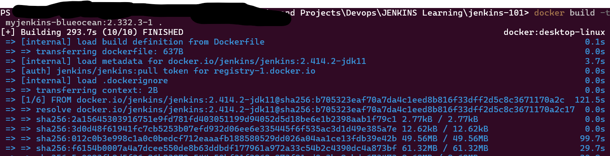

FINAL RESULT 

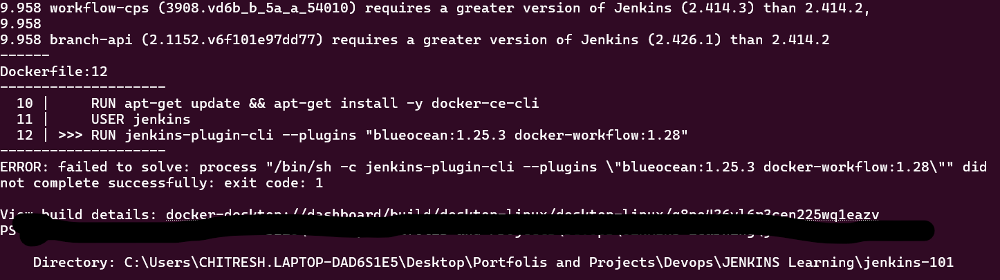

NOW type the 

```docker
docker network create jenkins
```

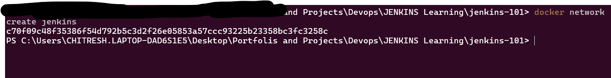

To verify it do 

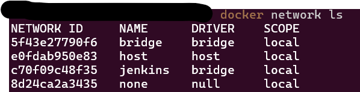

Now start the container 

```docker
docker run --name jenkins-blueocean --restart=on-failure --detach `
  --network jenkins --env DOCKER_HOST=tcp://docker:2376 `
  --env DOCKER_CERT_PATH=/certs/client --env DOCKER_TLS_VERIFY=1 `
  --volume jenkins-data:/var/jenkins_home `
  --volume jenkins-docker-certs:/certs/client:ro `
  --publish 8080:8080 --publish 50000:50000 myjenkins-blueocean:2.414.2
```

Docker file update 

```docker
FROM jenkins/jenkins:2.440.1-lts

USER root

# Install required dependencies
RUN apt-get update && apt-get install -y lsb-release

RUN curl -fsSLo /usr/share/keyrings/docker-archive-keyring.asc \
  https://download.docker.com/linux/debian/gpg

RUN echo "deb [arch=$(dpkg --print-architecture) \
  signed-by=/usr/share/keyrings/docker-archive-keyring.asc] \
  https://download.docker.com/linux/debian \
  $(lsb_release -cs) stable" > /etc/apt/sources.list.d/docker.list

RUN apt-get update && apt-get install -y docker-ce-cli

# Install plugins with CLI
RUN jenkins-plugin-cli --plugins "blueocean docker-workflow"

USER jenkins

```

We have to use this 

And to build 

```docker
docker build -t myjenkins-blueocean:2.440.1 .
```

```docker
docker run -d --name jenkins-blueocean -p 8080:8080 -p 50000:50000 myjenkins-blueocean:2.440.1
4980f71fc6ca5ce85861d5208d8e431ebd896201422ce2d6eb5d1ab09931bee5
```

use docker command 

```docker
docker ps 
```

You will get something like this 

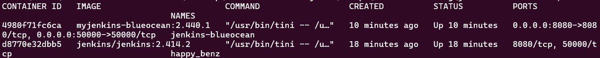

now go to port 

```docker
localhost:8080
```

you will get something like this 

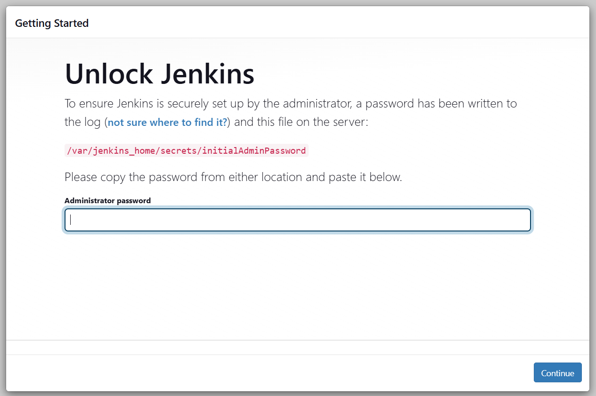

To get the password

```docker
docker exec jenkins-blueocean cat /var/jenkins_home/secrets/initialAdminPassword

```

You will get a really long number now paste that into the text field

Now you will get a screen like this 

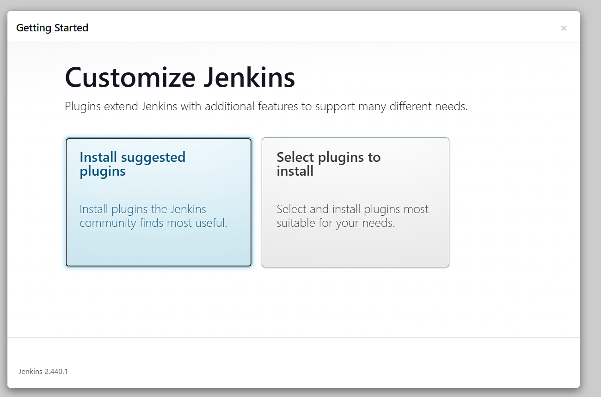

Click on `Install selected plugins`

Now you will get a screen like this 

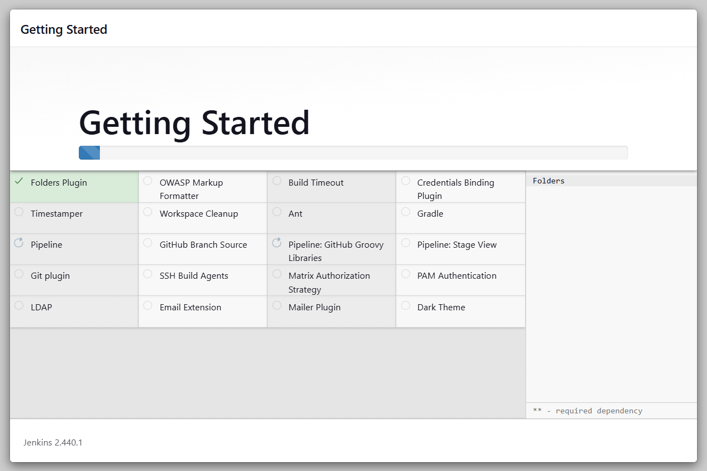

After it is done installing you will get a screen like this 

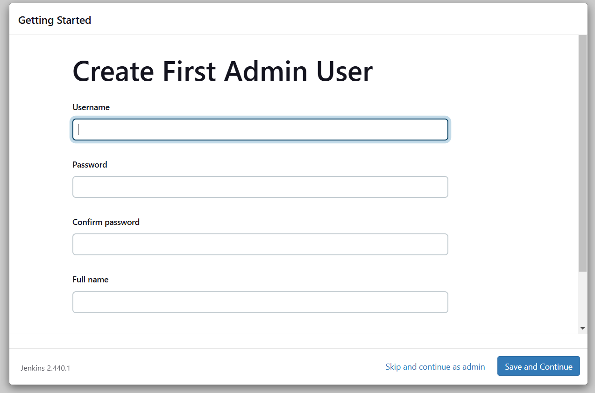

Fill your details and save and continue 

Now you will get a screen like this 

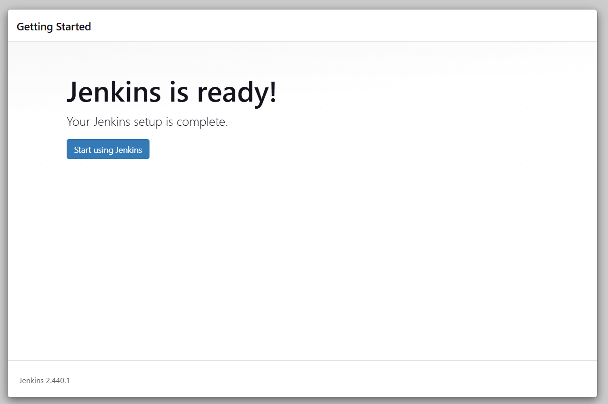

Now the dashboard will be something like this 

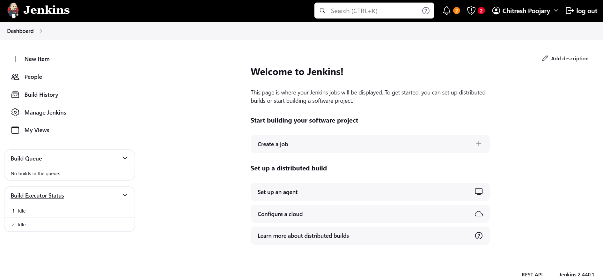

Okay btw in my case i had two images 

```docker
1) jenkins/jenkins
2) myjenkins-blueocean
```

To check the active containers we use 

```docker
docker ps -a
```

You will get something like this 

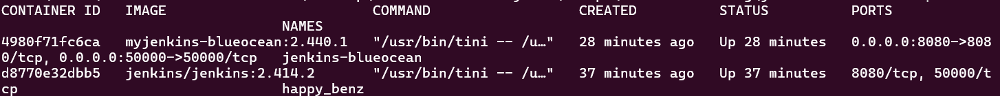

Since `myjenkins-blueocean`  is the latest one we keep and and remove the  `jenkins/jenkins`  one  to do that we simply 

First stop the container 

```docker
docker stop happy_benz
happy_benz
```

Then once it is stopped we do is remove it 

```docker
docker rm happy_benz
```

Then we remove the image 

```docker
docker rmi jenkins/jenkins:2.414.2

```

We should get something like this 

```docker
Untagged: jenkins/jenkins:2.414.2
Untagged: jenkins/jenkins@sha256:b705323eaf70a7da4c1eed8b816f33dff2d5c8c3671170a2c17cf77aa4f15432
Deleted: sha256:3d0d48f61941fc7cb5253b07efd932d06ee6e335445f6f535ac3d1d49e385a7e
```

Okay quick this before we proceed further incase you want to stop learning today and continue tommorow 

First before going to shutdown do this to stop the container 

1. Stop the container 

```docker
docker stop jenkins-blueocean
```

1. Verify status (check if the container has stopped)

```docker
**docker ps**
```

1. To see al container

```docker
docker ps -a
```

Now to start again

1. Check if the container exists 

```docker
docker ps -a
```

1. Start the container 

```docker
docker start jenkins-blueocean
```

1. Verify if jenkins is running 

```docker
docker ps
```

1. Then access jenkins in the browser 

```docker
http://localhost:8080
```